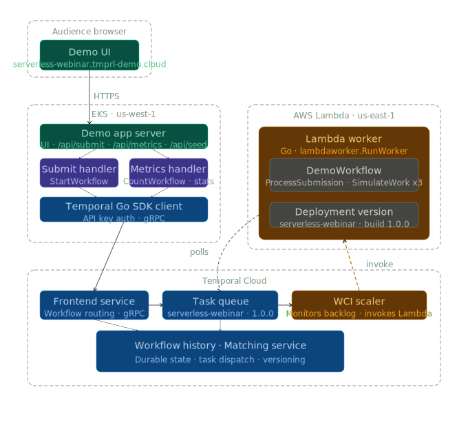

# temporal-serverless-no-roads

> *Where we're going, we don't NEED workers!*

A live audience-participation demo for Temporal's Serverless Workers feature. Attendees submit their name via a web UI to trigger real workflow executions, and watch Lambda invocations, task queue backlog, and workflow counts update in real time.

## Repo structure

```
temporal-serverless-no-roads/
├── shared/                    # Shared Go module — workflows, activities, task queue, worker config
│   ├── activities/            # ProcessSubmission + SimulateWork1/2/3 activity implementations
│   ├── taskqueue/             # Shared task queue name constant
│   ├── workerconfig/          # Reads worker concurrency from environment variables
│   │   └── .env               # Worker concurrency settings for local dev/to invoke for the Lambda
│   └── workflows/             # DemoWorkflow definition
├── lambda-worker/             # Deployable 1: Lambda worker (Go)
│   ├── cfn/
│   │   └── execution-role.yaml    # CloudFormation: Lambda execution role (CloudWatch + Secrets Manager)
│   ├── deploy-lambda.sh       # Build, package, create-or-update Lambda function
│   ├── Makefile               # Orchestrates cfn-execution-role → deploy
├── demo-app/                  # Deployable 2: HTTP server — UI + API (Go)
│   ├── api/                   # /api/submit, /api/metrics, /api/seed handlers
│   ├── cache/                 # Short-TTL metrics cache
│   ├── frontend/              # Embedded HTML UI (served at /)
│   ├── localworker/           # Long-polling worker for local dev (not deployed to Lambda)
│   ├── middleware/            # Per-IP rate limiter
│   └── k8s/                   # Kubernetes manifests for EKS deployment
├── go.work                    # Go workspace — ties all three modules together
└── README.md
```


## Architecture



Audience browsers submit their name via the demo UI, which is served by the
demo app running on EKS. The submit handler starts a `DemoWorkflow` via the
Temporal Go SDK client. Temporal Cloud receives it, routes it to the
`serverless-webinar` task queue, and the WCI scaler monitors backlog depth —
invoking the Lambda worker when tasks need processing. The Lambda worker polls
the task queue, executes `DemoWorkflow` (three chained `SimulateWork`
activities with built in delays to show execution over time), and exits when idle. The metrics handler polls Temporal Cloud for
workflow counts and task queue stats to drive the live dashboard.

---

## Metrics

See **[METRICS.md](./METRICS.md)** for a full breakdown of where each UI metric comes from, which Temporal API backs it, and the end-to-end lag from a real-world event to the number changing on screen.

---

## Running locally

Local dev uses the Temporal CLI dev server in place of Temporal Cloud, and a
standard long-polling worker in place of the Lambda worker. No AWS account or
Temporal Cloud namespace required.

### Prerequisites

- [Go 1.24+](https://go.dev/dl/)
- [Temporal CLI](https://docs.temporal.io/cli#installation)

```bash
# macOS
brew install temporal

# Linux — see https://temporal.download/cli/archive/latest?platform=linux&arch=amd64
```

### 1. Resolve dependencies

Run `go mod tidy` in each module. The workspace root has no `go.mod`, so this
must be done per-module:

```bash
cd shared        && go mod tidy && cd ..
cd lambda-worker && go mod tidy && cd ..
cd demo-app      && go get go.temporal.io/api && go mod tidy && cd ..
go work sync
```

> `go.temporal.io/api` needs an explicit entry in `demo-app/go.mod` because
> `metrics.go` imports `go.temporal.io/api/workflowservice/v1` directly for
> `CountWorkflowExecutionsRequest`.

### 2. Start the Temporal dev server

```bash
temporal server start-dev
```

Starts a local Temporal cluster at `localhost:7233`. Web UI at
[http://localhost:8233](http://localhost:8233). No auth, no TLS.

### 3. Start a local worker

The Lambda worker uses `lambdaworker.RunWorker`, which exits after each task
batch and is not suited for local iteration. Use the long-polling local worker
instead:

```bash
cd demo-app
go run ./localworker/main.go
```

Concurrency is configured via `demo-app/localworker/.env`. The defaults (5
concurrent activities, 5 workflow tasks) are intentionally low to simulate
single-Lambda-invocation capacity, making backlog depth and sync match rate
pressure visible with a realistic seed count. To override for one run:

```bash
WORKER_MAX_CONCURRENT_ACTIVITIES=2 go run ./localworker/main.go
```

### 4. Start the demo app

```bash
cd demo-app
go run .
```

The demo app is available at [http://localhost:8080](http://localhost:8080).

### 5. Try it out

Open [http://localhost:8080](http://localhost:8080), enter a name, click **Start
workflow**, and watch the dashboard update. To saturate the worker and produce
visible backlog and sync match rate pressure, fire a seed burst:

```bash
curl -X POST http://localhost:8080/api/seed?count=30
```

Or activate presenter mode in the UI at `?presenter=1` in the URL.

### Local environment summary

| Terminal | Command | Purpose |
|---|---|---|
| 1 | `temporal server start-dev` | Local Temporal cluster + Web UI |
| 2 | `cd demo-app && go run ./localworker/main.go` | Long-polling worker |
| 3 | `cd demo-app && go run .` | Demo app server |

---

## Deploying the Lambda worker to AWS

This section covers the complete end-to-end process for deploying the Lambda
worker to the SA AWS account and connecting it to Temporal Cloud.

> **Namespace auth requirement:** This repo assumes that your Temporal Cloud namespace is
> configured for **API key authentication**.

### Prerequisites

- A Temporal Cloud namespace with API key. Download them from
  the Temporal Cloud UI under your
  namespace → **API Keys**.

- Temporal CLI installed (`brew install temporal`).

### Step 1 — Store the Temporal API key in Secrets Manager

Store your API key so the Lambda can fetch it at cold start without it being
visible in plain text as an environment variable.

```bash
aws secretsmanager create-secret \
  --name temporal/serverless-webinar/api-key \
  --secret-string "<your-temporal-api-key>" \
  --region <your-region> \
  --profile <your-profile>
```

> To update the secret on subsequent runs, use `put-secret-value` instead of
> `create-secret`.
>
> **Simpler alternative for demos:** skip this step and set `TEMPORAL_API_KEY`
> directly as a Lambda environment variable in Step 4. The key is visible in
> the Lambda console, which is fine for a short-lived demo but not for
> production.

### Step 2 — Deploy the Lambda execution role (CloudFormation)

Creates the IAM execution role the Lambda function assumes at runtime. Grants
CloudWatch Logs write access and Secrets Manager read access for the API key
stored in Step 1.

```bash
cd lambda-worker
make cfn-execution-role
```

Prints the role ARN when complete. Copy it — you need it in Step 3.

### Step 3 — Create the Lambda function and deploy worker code

On first run this creates the Lambda function; on subsequent runs it updates the
code only.

```bash
make deploy \
  EXECUTION_ROLE=arn:aws:iam::<your-aws-account-id>:role/serverless-webinar-worker-execution-role
```

This cross-compiles the Go binary for `linux/amd64`, packages it, and creates
(or updates) the Lambda function with a 600-second timeout and 256 MB memory.

Note the **Lambda ARN** printed in the output — you need it in Step 5.

### Step 4 — Set Lambda environment variables

Set the Temporal connection config and credentials on the deployed function. Use
Option A or Option B for the API key depending on what you chose in Step 1.

```bash
aws lambda update-function-configuration \
  --function-name serverless-webinar-worker \
  --environment "Variables={
    TEMPORAL_ADDRESS=<your-namespace>.<account-id>.tmprl.cloud:7233,
    TEMPORAL_NAMESPACE=<your-namespace>.<account-id>,
    TEMPORAL_API_KEY_SECRET_ARN=arn:aws:secretsmanager:<your-region>:<your-aws-account-id>:secret:temporal/serverless-webinar/api-key-<suffix>,
    WORKER_MAX_CONCURRENT_ACTIVITIES=5,
    WORKER_MAX_CONCURRENT_WORKFLOWS=5
  }" \
  --region <your-region> \
  --profile <your-profile>
```

See the [Configuration reference](#configuration-reference) section for
concurrency tuning guidance.

### Step 5 — Create the worker deployment in Temporal Cloud

This step is done entirely in the Temporal Cloud UI. It wires the Lambda ARN to
Temporal and creates the IAM role Temporal uses to invoke it.

1. Open your namespace in the [Temporal Cloud UI](https://cloud.temporal.io).
2. Navigate to **Workers → Serverless** and click **Create Worker Deployment**.
3. Fill in:
   - **Name**: `serverless-webinar`
   - **Build ID**: `1.0.0`
   - **Compute**: AWS Lambda
   - **Lambda ARN**: the ARN from Step 3
4. The right panel shows a CloudFormation template. Deploy it to create the IAM
   role that Temporal Cloud uses to invoke your Lambda:
   - Copy or download the template from the UI
   - Deploy it:
     ```bash
     aws cloudformation deploy \
       --stack-name temporal-webinar-invoke-role \
       --template-file <downloaded-template.yaml> \
       --capabilities CAPABILITY_NAMED_IAM \
       --region <your-region> \
       --profile <your-profile>
     ```
   - Note the **IAM Role ARN** from the stack outputs
5. Back in the Temporal Cloud UI, fill in:
   - **IAM Role ARN**: the ARN from the CloudFormation stack above
   - **External ID**: pre-filled by the UI (matches the deployment name)
6. Optionally expand **Show Scaling and Limits** to configure min/max instances
   before submitting.
7. Click **Create**.

After creation, Temporal Cloud will invoke your Lambda automatically whenever
workflows are started on the `serverless-webinar` task queue.

### Step 6 — Verify

Start a test workflow to confirm end-to-end connectivity:

```bash
temporal workflow start \
  --type DemoWorkflow \
  --task-queue serverless-webinar \
  --input '{"name":"test"}' \
  --address <your-namespace>.<account-id>.tmprl.cloud:7233 \
  --namespace <your-namespace>.<account-id> \
  --api-key <your-temporal-api-key>
```

Check the Temporal Cloud UI for the running workflow and the AWS Lambda console
for an invocation. If it executes and completes, everything is wired up
correctly.

### Lambda deployment summary

| Step | What it does |
|---|---|
| 1 | Store Temporal API key in Secrets Manager |
| 2 | `make cfn-execution-role` — Lambda execution role |
| 3 | `make deploy EXECUTION_ROLE=...` — create Lambda + upload code |
| 4 | `aws lambda update-function-configuration` — set env vars |
| 5 | Temporal Cloud UI — deploy CFN template, create worker deployment |
| 6 | `temporal workflow start` — end-to-end smoke test |

### Redeploying after code changes

Once the Lambda function and IAM roles exist, redeploy is just:

```bash
cd lambda-worker
make deploy EXECUTION_ROLE=arn:aws:iam::<your-aws-account-id>:role/serverless-webinar-worker-execution-role
```

If you bump the `BuildID` in `lambda-worker/main.go`, open the Temporal Cloud UI
and create a new deployment version with the updated build ID, then set it as
current.

---

## Deploying the demo app to EKS

### Prerequisites

- Docker and `kubectl` configured for the SA EKS cluster
- An ECR repository for the demo app image

### 1. Build and push the Docker image

```bash
# Authenticate Docker to ECR
aws ecr get-login-password \
  --region us-east-1 \
  --profile <your-profile> \
  | docker login --username AWS --password-stdin \
    <your-aws-account-id>.dkr.ecr.<your-region>.amazonaws.com

# Build from the repo root (Dockerfile references ../shared)
docker build \
  -t <your-aws-account-id>.dkr.ecr.<your-region>.amazonaws.com/serverless-webinar-app:latest \
  -f demo-app/Dockerfile .

docker push <your-aws-account-id>.dkr.ecr.<your-region>.amazonaws.com/serverless-webinar-app:latest
```

### 2. Create the Temporal credentials Secret

The demo app reads `TEMPORAL_ADDRESS`, `TEMPORAL_NAMESPACE`, and
`TEMPORAL_API_KEY` from environment variables at startup (via
`workerconfig.BuildClientOptions()`). Store them in a k8s Secret:

```bash
kubectl create secret generic temporal-serverless-webinar \
  --from-literal=serverless-webinar-temporal-address='<your-namespace>.<account-id>.tmprl.cloud:7233' \
  --from-literal=serverless-webinar-temporal-namespace='<your-namespace>.<account-id>' \
  --from-literal=serverless-webinar-temporal-api-key='<your-temporal-api-key>'
```

### 4. Update the k8s manifests

One placeholder needs filling in before you apply:

**`demo-app/k8s/deployment.yaml`** — replace the ECR image URI:
```yaml
image: <your-aws-account-id>.dkr.ecr.<your-region>.amazonaws.com/serverless-webinar-app:latest
```

All other values (secret key names, container port) are already correct.

> Note: This is set up for an EKS cluster using Traefik + a cert for https, and as such includes `ingressroute.yaml` and `certficiate.yaml`. The ALB forwards all traffic to Traefik which routes based on the `Host` header to your service.

### 5. Apply

```bash
kubectl apply -f demo-app/k8s/certificate.yaml -n serverless-webinar
kubectl apply -f demo-app/k8s/service.yaml -n serverless-webinar
kubectl apply -f demo-app/k8s/deployment.yaml -n serverless-webinar
kubectl apply -f demo-app/k8s/ingressroute.yaml -n serverless-webinar
```

Wait for the TLS certificate to be issued by cert-manager before testing the URL
— this typically takes 30–60 seconds:

```bash
kubectl get certificate -n serverless-webinar -w
```

Wait for `READY` to show `True`, then check rollout status:

```bash
kubectl rollout status deployment/serverless-webinar-app -n serverless-webinar
```

The demo app will be available at the hostname configured in `ingressroute.yaml`
(currently `https://serverless-webinar.tmprl-demo.cloud`).

---

## Presenter mode

The UI has a hidden presenter panel for triggering workflow bursts during the
live demo. Not visible to the audience by default.

**Activate** by adding `?presenter=1` to the URL before screen sharing

The panel fires N workflows simultaneously (default 30, max 200) to prime the
scaling visuals before or during the audience participation moment.

---

## Configuration reference

### Lambda worker environment variables

| Variable | Required | Description |
|---|---|---|
| `TEMPORAL_ADDRESS` | Yes | Temporal Cloud gRPC endpoint (`<namespace>.<account>.tmprl.cloud:7233`) |
| `TEMPORAL_NAMESPACE` | Yes | Temporal namespace ID (`<namespace>.<account>`) |
| `TEMPORAL_API_KEY` | Either/or | API key value directly (Option A) |
| `TEMPORAL_API_KEY_SECRET_ARN` | Either/or | Secrets Manager ARN to fetch the key from at cold start (Option B) |
| `WORKER_MAX_CONCURRENT_ACTIVITIES` | No | Max activity tasks per invocation (default: `5`) |
| `WORKER_MAX_CONCURRENT_WORKFLOWS` | No | Max workflow tasks per invocation (default: `5`) |

The `.env` file in `lambda-worker/` documents all variables but is not bundled
in the deployment zip.

### Demo app environment variables

| Variable | Required | Description |
|---|---|---|
| `TEMPORAL_ADDRESS` | No | Temporal server address (default: `localhost:7233`) |
| `TEMPORAL_NAMESPACE` | No | Temporal namespace (default: `default`) |
| `TEMPORAL_API_KEY` | No | Temporal Cloud API key |

### Worker concurrency tuning

Both the local worker and the Lambda worker read `WORKER_MAX_CONCURRENT_ACTIVITIES`
and `WORKER_MAX_CONCURRENT_WORKFLOWS` via `shared/workerconfig`. The startup log
always prints the values in use.

With `WORKER_MAX_CONCURRENT_ACTIVITIES=5` and each `SimulateWork` activity
sleeping for 12 seconds, the worker saturates at 5 concurrent workflows. A seed
burst of 30 immediately queues 25 activity tasks, driving the sync match rate
down and triggering Lambda scaling.

To update the values on the deployed Lambda:

```bash
aws lambda update-function-configuration \
  --function-name serverless-webinar-worker \
  --environment "Variables={WORKER_MAX_CONCURRENT_ACTIVITIES=5,WORKER_MAX_CONCURRENT_WORKFLOWS=5}" \
  --region <your-region> \
  --profile <your-profile>
```

### Activity sleep durations

Control how long each workflow holds worker capacity. Edit the constants in
`shared/activities/demo_activities.go`:

```go
const (
    WorkDuration1 = 12 * time.Second
    WorkDuration2 = 12 * time.Second
    WorkDuration3 = 12 * time.Second
)
```

Each workflow chains all three sequentially (~36 seconds total worker
occupancy). `StartToCloseTimeout` in `shared/workflows/demo_workflow.go` must
always exceed the sum of all three.

**Lambda timeout** is set to 600 seconds at creation — well above the 36-second
activity chain. **Lambda memory** is set to 256 MB; increase if you observe
memory pressure in CloudWatch Logs.
